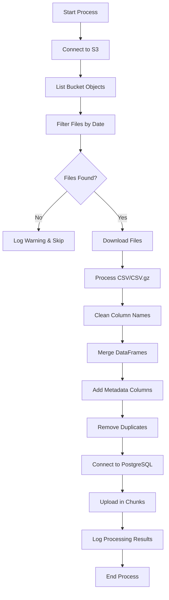

# S3 to PostgreSQL ETL Process

A robust Python-based ETL (Extract, Transform, Load) pipeline that downloads CSV files from Amazon S3, merges them by date, and loads the processed data into a PostgreSQL database.

## Features

- 🚀 **Automated S3 Data Processing**: Downloads and processes CSV/CSV.gz files from S3
- 📅 **Date-based File Filtering**: Intelligently extracts dates from filenames using regex patterns
- 🔄 **Data Merging**: Combines multiple files from the same date into a single dataset
- 🗄️ **PostgreSQL Integration**: Loads processed data directly into PostgreSQL with chunked uploads
- 📊 **Comprehensive Logging**: Detailed processing logs with file-level tracking
- 🛡️ **Error Handling**: Robust error handling with retry mechanisms
- 📈 **Progress Tracking**: Processing logs stored in database for audit trails

## Prerequisites

- Python 3.7+
- PostgreSQL database
- AWS S3 access credentials
- Required Python packages (see requirements.txt)

## Installation

1. **Clone the repository**
   ```bash
   git clone https://github.com/Srayoshi-Mirza/ETL-from-S3-to-PostgreSQL-Template.git
   cd ETL-from-S3-to-PostgreSQL-Template
   ```

2. **Install dependencies**
   ```bash
   pip install -r requirements.txt
   ```

3. **Set up environment variables**
   Create a `.env` file in the project root:
   ```env
   # AWS Configuration
   AWS_ACCESS_KEY_ID=your_aws_access_key
   AWS_SECRET_ACCESS_KEY=your_aws_secret_key
   BUCKET_NAME=your-s3-bucket-name

   # Database Configuration
   DB_TYPE=postgresql
   DW_PG_HOST=your-database-host
   DW_PG_PORT=5432
   DW_PG_DATABASE=your-database-name
   DW_PG_USER=your-database-username
   DW_PG_PASSWORD=your-database-password
   ```

## Usage

### Basic Commands

1. **Analyze available dates in S3 bucket**
   ```bash
   python s3_postgres_processor.py --analyze-dates
   ```

2. **Process a single date**
   ```bash
   python s3_postgres_processor.py --start-date 2025-01-15
   ```

3. **Process a date range**
   ```bash
   python s3_postgres_processor.py --start-date 2025-01-15 --end-date 2025-01-20
   ```

### Command Line Arguments

| Argument | Description | Required | Example |
|----------|-------------|----------|---------|
| `--start-date` | Start date for processing (YYYY-MM-DD) | Yes* | `2025-01-15` |
| `--end-date` | End date for processing (YYYY-MM-DD) | No | `2025-01-20` |
| `--analyze-dates` | Analyze bucket contents and show available dates | No | - |

*Required unless using `--analyze-dates`

## File Naming Conventions

The ETL process supports various filename patterns for date extraction:

### Supported Patterns

- **ISO DateTime**: `data_2025-02-03T030000_export.csv.gz`
- **ISO Date**: `sales_2025-02-03.csv`
- **US Format**: `backup_02-03-2025_120000.sql`
- **Compact Format**: `report_20250203.xlsx`
- **Underscore Separated**: `logs_2025_02_03.txt`
- **Dot Separated**: `analytics.2025.02.03.json`

### Custom Patterns

You can modify the `extract_date_from_filename()` function to support additional naming conventions specific to your data sources.

## Data Processing Flow



## Database Schema

### Main Data Table: `table_name`
- Contains merged data from all processed files
- Includes original columns plus metadata:
  - `source_file`: Original filename
  - `processed_date`: When the data was processed
  - `source_date`: Date extracted from filename
  - `files_merged_count`: Number of files merged
  - `*_datetime`: Converted timestamp columns (if applicable)

### Processing Log Table: `data_processing_log`
| Column | Type | Description |
|--------|------|-------------|
| `date_processed` | TIMESTAMP | When processing occurred |
| `date_of_data` | DATE | Date of the processed data |
| `files_processed` | INTEGER | Number of files successfully processed |
| `files_merged` | INTEGER | Number of files merged |
| `table_name` | VARCHAR | Target table name |
| `total_row_count` | INTEGER | Total rows loaded |
| `column_count` | INTEGER | Number of columns in final dataset |
| `source_files` | TEXT | Comma-separated list of source files |

## Configuration

### Database Settings
The script supports multiple database types through SQLAlchemy:
- PostgreSQL (recommended)
- MySQL
- SQL Server

### Performance Tuning
- **Chunk Size**: Default 10,000 rows per upload chunk
- **Connection Pool**: Optimized for large datasets
- **Memory Management**: Processes files individually to manage memory usage

### File Processing
- **Supported Formats**: CSV, CSV.gz
- **Encoding**: UTF-8
- **Duplicate Handling**: Automatic detection and removal
- **Empty Columns**: Automatically removed before upload

## Logging

The script generates comprehensive logs:

### Log Levels
- **INFO**: Processing progress and summaries
- **WARNING**: Non-critical issues (missing files, duplicates)
- **ERROR**: Critical errors that stop processing
- **DEBUG**: Detailed debugging information

### Log Outputs
- **Console**: Real-time processing updates
- **File**: `s3_postgres_processor.log` for persistent logging
- **Database**: Processing summaries in `data_processing_log` table

## Error Handling

### Common Issues and Solutions

1. **No files found for date**
   - Check filename patterns match your S3 files
   - Use `--analyze-dates` to see available dates
   - Verify date format in command line arguments

2. **Database connection failed**
   - Verify database credentials in `.env` file
   - Check network connectivity to database
   - Ensure database exists and user has proper permissions

3. **Memory issues with large files**
   - Adjust `chunk_size` parameter in the script
   - Process smaller date ranges
   - Monitor system memory usage

4. **S3 access denied**
   - Verify AWS credentials and permissions
   - Check bucket name and region settings
   - Ensure IAM user has S3 read permissions

## Monitoring and Maintenance

### Daily Operations
```bash
# Check processing status for yesterday
python s3_postgres_processor.py --start-date $(date -d "yesterday" +%Y-%m-%d)

# View processing logs
tail -f s3_postgres_processor.log
```

### Database Monitoring
```sql
-- Check recent processing activity
SELECT * FROM data_processing_log 
ORDER BY date_processed DESC 
LIMIT 10;

-- Check data volume by date
SELECT source_date, COUNT(*) as record_count 
FROM table_name 
GROUP BY source_date 
ORDER BY source_date DESC;
```

## Customization

### Adding New File Patterns
Modify the `extract_date_from_filename()` function to support additional filename patterns:

```python
def extract_date_from_filename(filename):
    # Add your custom pattern
    custom_pattern = re.search(r'your_pattern_(\d{4}-\d{2}-\d{2})', filename)
    if custom_pattern:
        return custom_pattern.group(1)
    
    # ... existing patterns
```

### Custom Data Transformations
Add data transformation logic in the `process_single_day()` function:

```python
# Add custom transformations after merging
merged_df['custom_column'] = merged_df['existing_column'].apply(your_transformation)
```

## License

This project is licensed under the MIT License - see the LICENSE file for details.

## Support

For issues and questions:
1. Check the logs for error details
2. Review this README for common solutions
3. Create an issue in the repository with:
   - Error messages
   - Sample filenames
   - Environment details

## Changelog

### v1.0.0
- Initial release
- S3 to PostgreSQL ETL pipeline
- Date-based file filtering
- Chunked database uploads
- Comprehensive logging
